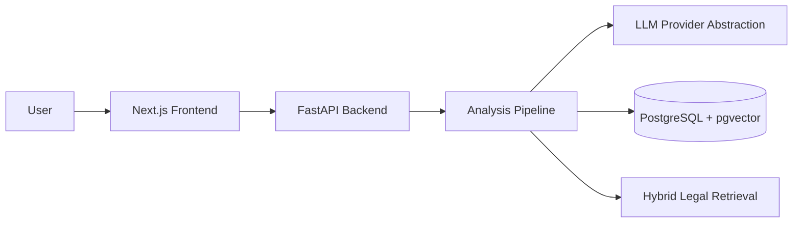

# NyayaLens

**Evidence-grounded legal case analysis and decision-support for Indian law.**

NyayaLens helps users understand their legal situation by structuring facts, identifying legal issues, retrieving relevant Indian law, analyzing both sides of a dispute, and highlighting missing information — with citations, not guesswork.

> NyayaLens provides general legal information and AI-assisted case analysis. It is **not** a substitute for advice from a qualified advocate.

## Why NyayaLens Exists

Legal disputes are confusing. People often don't know:

- What facts matter legally
- Which laws might apply
- What evidence they need
- What the other side might argue
- What questions to ask a lawyer

NyayaLens bridges this gap with structured AI reasoning, hybrid legal retrieval, and explicit uncertainty — demonstrating production-quality legal-tech engineering, not just LLM text generation.

## Architecture



See [docs/architecture.md](docs/architecture.md) for full details.

## Tech Stack

| Layer | Technology |
|-------|-----------|
| Frontend | Next.js, TypeScript, Tailwind CSS, shadcn/ui |
| Backend | Python, FastAPI, Pydantic, SQLAlchemy |
| Database | PostgreSQL, pgvector |
| AI | LLM abstraction (mock / OpenAI / Anthropic) |
| Infrastructure | Docker, docker-compose |

## Quick Start

### Prerequisites

- Docker & Docker Compose
- Node.js 20+ (for local frontend dev)
- Python 3.11+ (for local backend dev)

### Option A: Local (no Docker) — recommended for Windows

```powershell
# One-time setup
.\scripts\setup-local.ps1

# Start API + frontend (opens two terminal windows)
.\scripts\start-local.ps1
```

Or run manually in **two separate terminals**:

```powershell
# Terminal 1 — API
cd apps\api
..\..\.venv\Scripts\python.exe -m uvicorn app.main:app --reload --port 8000

# Terminal 2 — Frontend
cd apps\web
npm run dev
```

Uses **SQLite** by default (no PostgreSQL needed). Data is stored in `data/nyayalens.db`.

### Option B: Docker (requires Docker Desktop)

```bash
cp .env.example .env
docker compose up --build
```

### Demo Mode

Visit http://localhost:3000/demo for five synthetic cases (tenancy, cyber fraud, consumer, employment, harassment).

## API Endpoints

Versioned under `/api/v1` (unprefixed `/cases` remains for compatibility).

| Method | Path | Description |
|--------|------|-------------|
| GET | `/api/v1/health` | Health check |
| POST | `/api/v1/auth/register` | Register |
| POST | `/api/v1/auth/login` | Login |
| POST | `/api/v1/cases` | Create a case |
| GET | `/api/v1/cases` | List cases |
| GET | `/api/v1/cases/{id}` | Get case |
| POST | `/api/v1/cases/{id}/analyze` | Run analysis pipeline |
| GET | `/api/v1/cases/{id}/analysis` | Latest analysis |
| GET | `/api/v1/cases/{id}/sources` | Retrieved sources |
| POST | `/api/v1/cases/{id}/messages` | Follow-up question |
| GET | `/api/v1/cases/{id}/messages` | Chat history |
| POST | `/api/v1/legal/search` | Hybrid legal search |
| GET | `/api/v1/legal/sources` | List knowledge-base provisions |

## Ingestion

```powershell
.\.venv\Scripts\python.exe scripts\ingest_legal_sources.py
```

Sources live in `data/legal_sources/seed_sources.json` and can be updated without changing application code.

## Testing

```powershell
.\.venv\Scripts\python.exe -m pytest tests/unit tests/integration -v
```

## Current status

- [x] Case structuring, classification, issues, hybrid retrieval
- [x] Legal analysis, both-side arguments, missing facts, next steps
- [x] Citation validation against retrieved sources
- [x] Case chat grounded in RAG
- [x] Dashboard and knowledge-base admin view
- [x] Optional JWT auth and case-level access checks
- [x] Mock LLM fallback (no API key required)
- [ ] Full evidence locker / OCR
- [ ] Production Alembic migration history for PostgreSQL
- [ ] Hosted evaluation dashboard with live metrics

## Limitations

- The legal corpus is a **small curated demo set**, not all Indian law.
- Mock mode produces structured pipeline output without a paid LLM.
- Do not treat results as legal advice or as a prediction of court outcomes.
- SQLite is the default local store; PostgreSQL + pgvector is for Docker/production hybrid search at scale.

## Project Structure

```
/apps/web              Next.js frontend
/apps/api              FastAPI backend
/packages/schemas      Shared Pydantic domain models
/services/             Microservice modules (pipeline stages)
/data/                 Legal sources & sample cases
/docs/                 Architecture & design docs
/tests/                Unit, integration & evaluation tests
```

## Configuration

See [.env.example](.env.example) for all environment variables.

| Variable | Default | Description |
|----------|---------|-------------|
| `LLM_PROVIDER` | `mock` | LLM provider (`mock` / `openai` / `anthropic`) |
| `DATABASE_URL` | SQLite file | Use PostgreSQL in Docker/production |
| `JWT_SECRET_KEY` | local dev secret | Required for auth tokens |
| `CORS_ORIGINS` | `http://localhost:3000` | Allowed frontend origins |

## Legal Disclaimer

NyayaLens provides general legal information and AI-assisted case analysis. It is not a substitute for advice from a qualified advocate. Legal outcomes depend on facts, evidence, jurisdiction, procedure, and applicable law. Always consult a qualified legal professional for advice specific to your situation.

## License

Private — All rights reserved.
