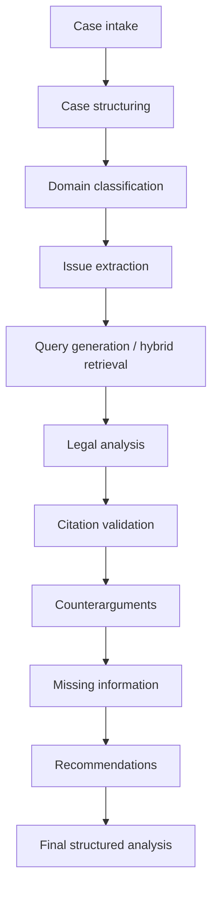

# Agent pipeline

Each stage is a separate module with typed inputs and outputs. The orchestrator does not use one giant prompt.

| Stage | Module | Input | Output |
|-------|--------|-------|--------|
| Case structuring | `CaseParserService` | Natural-language description | Parties, facts, unknown facts |
| Classification | `ClassificationService` | Description | Legal domains, summary, inferences |
| Issue extraction | `IssueIdentifierService` | Facts + description | Typed issues |
| Retrieval | `LegalRetriever` | Description + issues | Ranked `LegalSource` list |
| Legal analysis | `LegalAnalyzerService` | Issues + retrieved sources | Per-issue provisions |
| Citation validation | `CitationValidator` | Analyses + retrieved sources | Unsupported claims removed/flagged |
| Counterarguments | `ArgumentAnalyzerService` | Case + sources | Claimant and respondent arguments |
| Missing information | `MissingFactDetector` | Unknown facts + issues | Prioritized questions |
| Recommendations | `RecommendationEngine` | Issues + gaps | Next steps |
| Chat | `ChatService` | Question + case context | Answer + retrieved citations |

Legal claims that cannot be tied to a retrieved knowledge-base row are not presented as citations.
