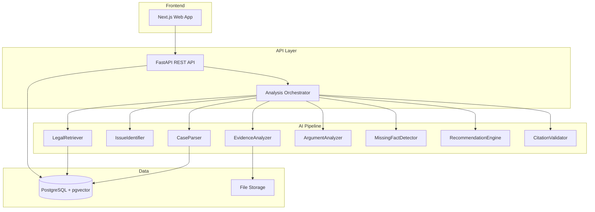

# NyayaLens Architecture

## Overview

NyayaLens is a monorepo legal-tech platform combining structured AI reasoning, hybrid legal retrieval, evidence analysis, and citation validation for Indian law.



## Repository Structure

```
/apps
  /web          — Next.js frontend
  /api          — FastAPI backend
/services
  /legal_ingestion
  /legal_retrieval
  /case_analysis
  /evidence_analysis
  /evaluation
/packages
  /schemas      — Shared Pydantic domain models
  /shared
/data
  /legal_sources
  /sample_cases
/docs
/tests
```

## Analysis Pipeline Stages

| Stage | Component | Input | Output |
|-------|-----------|-------|--------|
| 1 | CaseParser | Natural language | Structured Case |
| 2 | IssueIdentifier | Case + Facts | Legal Issues |
| 3 | LegalRetriever | Issues | Legal Sources |
| 4 | LegalAnalyzer | Issues + Sources | Provisions + Analysis |
| 5 | ArgumentAnalyzer | Case + Sources | Both-side Arguments |
| 6 | EvidenceAnalyzer | Documents | Evidence Mappings |
| 7 | MissingFactDetector | Case + Analysis | Prioritized Questions |
| 8 | RecommendationEngine | Full Analysis | Next Steps |
| 9 | CitationValidator | Claims + Sources | Verified Citations |

## LLM Abstraction

Providers are swappable via `LLM_PROVIDER` environment variable:

- `mock` — Local development (default)
- `openai` — OpenAI GPT models
- `anthropic` — Anthropic Claude models

All AI components depend on the `LLMProvider` interface, not a specific vendor.

## Database

PostgreSQL with pgvector for hybrid retrieval:

- Full-text search on legal source text
- Vector similarity for semantic retrieval
- Metadata filtering by jurisdiction, source type, effective date

## Current Implementation Status

**Completed:**
- Monorepo, domain models, SQLite/PostgreSQL schema
- Full agent pipeline (structure → classify → issues → retrieve → analyze → validate citations → both sides → missing facts → next steps)
- Case chat, dashboard, knowledge-base admin
- Optional JWT auth

**Next:**
- Evidence locker / OCR
- Alembic history for PostgreSQL
- Hosted evaluation metrics
