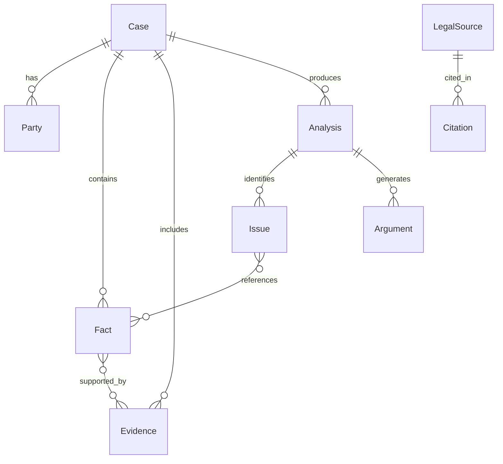

# Legal Data Model

## Core Entities

### Case
Central entity representing a user's legal situation.

| Field | Type | Description |
|-------|------|-------------|
| id | UUID | Primary key |
| description | Text | Original natural language input |
| case_type | String | Inferred case category |
| incident_date | Date | When the incident occurred |
| jurisdiction | Enum | Legal jurisdiction (India, state, UT) |
| is_demo | Boolean | Synthetic demo flag |

### Party
| Field | Type | Description |
|-------|------|-------------|
| name | String | Party identifier |
| role | Enum | claimant, respondent, third_party, unknown |

### Fact
| Field | Type | Description |
|-------|------|-------------|
| description | Text | Factual statement |
| fact_type | Enum | alleged, disputed, undisputed, unknown |
| confidence | Enum | high, medium, low, insufficient_evidence |

### LegalSource
| Field | Type | Description |
|-------|------|-------------|
| title | String | Source title |
| source_type | Enum | constitution, act, rule, regulation, judgment, etc. |
| section | String | Section/article reference |
| text | Text | Full provision text |
| effective_date | Date | When provision took effect |
| repeal_date | Date | When provision was repealed |
| version | String | Version identifier |

## Relationships

## Versioning

Legal provisions support temporal versioning:

- `effective_date` — when the provision became law
- `repeal_date` — when it was repealed (null if active)
- `amendment_history` — JSON array of amendment records
- `version` — semantic version string

The analysis engine uses `incident_date` from the case to determine which version of law may apply.

## Statement Types

Every AI-generated statement is classified:

| Type | Meaning |
|------|---------|
| FACT | Directly stated in user input or evidence |
| INFERENCE | Logical deduction from facts |
| LEGAL_SOURCE | Directly from a retrieved legal provision |
| MODEL_INTERPRETATION | AI's analysis applying law to facts |

These types must never be mixed silently in output.
