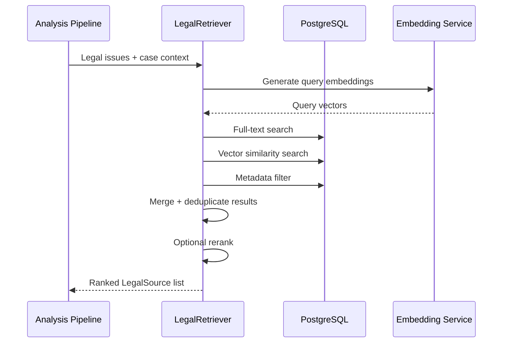

# Legal Retrieval Architecture

## Hybrid Search Strategy

NyayaLens uses hybrid retrieval combining multiple signals:

1. **PostgreSQL full-text search** — keyword matching on legal source text
2. **pgvector similarity search** — semantic matching via embeddings
3. **Metadata filtering** — jurisdiction, source type, effective date range
4. **Optional reranking** — cross-encoder or LLM-based reranking

Never rely exclusively on vector similarity.

## Retrieval Flow

## Source Schema

Each retrieved source retains:

- Source ID
- Title, jurisdiction, source type
- Section/article reference
- Full text
- Effective date, version
- Source URL
- Retrieval timestamp

## Citation Requirements

- Every legal claim must link to a retrieved source
- Unsupported claims are marked or removed
- If no reliable source found: explicit "could not find source" message

## Implementation Status

**Planned:** Hybrid search service in `/services/legal_retrieval`
**Current:** Database schema ready; retrieval service not yet implemented
